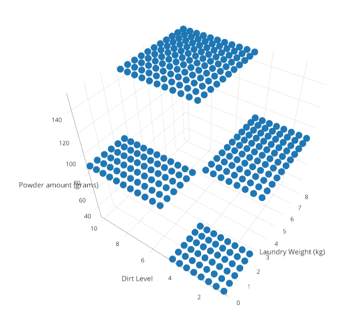

# Fuzzy logic examples


## Washing machine program simulation

This project features a simple solution of a fuzzy-logic problem. The inputs are
numerical values representing the weight of the laundry in kilograms and
the dirtyness level from 1 to 10. The output is the set of washing parameters,
namely the amount of powder in grams being used for washing.

Run `python -u laundry.py` and enter the input parameters for washing. The
program will output the used washing parameters (numerical values).


## Internals

The fuzzy logic implemented maps the input numerical values to their fuzzy
descriptions and then performs the fuzzy logic operation given the set of expert
rules.

```python
expert_rule_map = {
     (Quantity.SMALL, Level.LOW): Quantity.SMALL,
     (Quantity.MEDIUM, Level.LOW): Quantity.MEDIUM,
     (Quantity.LARGE, Level.LOW): Quantity.MEDIUM,
     (Quantity.SMALL, Level.HIGH): Quantity.MEDIUM,
     (Quantity.MEDIUM, Level.HIGH): Quantity.LARGE,
     (Quantity.LARGE, Level.HIGH): Quantity.LARGE}
  """Maps the expert rules as:
     (laundry_amount_fuzzy, dirt_level_fuzzy) -> powder_amount_fuzzy"""
```

The resulting fuzzy decription of the amount of powder is finally being decoded
into a numerical value used by the washing machine program: the powder amount in
grams.

Problem author is
[Dr.sc. Marko Horvat, dipl. ing.](http://marko-horvat.name/site/).


## Evaluation

Run the `evaluate.py` script to get a sense of how inputs map to outputs,
you can also see this data on a 3d graph.



You can recreate the graph using [PlotLy](https://plot.ly/create/) or view
the [existing graph](https://plot.ly/create/?fid=kburnik:3).

